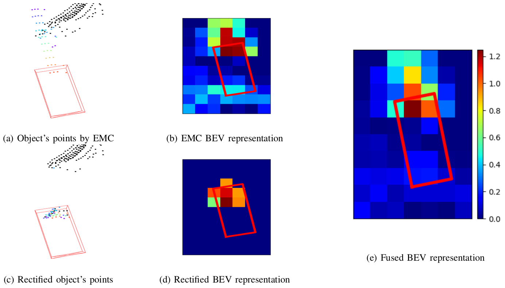

# Aligning Bird-Eye View Representation of Point Cloud Sequences using Scene Flow

This implementation of our paper is based on [`OpenPCDet`](https://github.com/open-mmlab/OpenPCDet/). 
Please follow their instruction to install dependencies and prepare datasets before using this repository.

## Abstract
Low-resolution point clouds are challenging for object detection methods due to their sparsity. 
Densifying the present point cloud by concatenating it with its predecessors is a popular solution to this challenge. 
Such concatenation is possible thanks to the removal of ego vehicle motion using its odometry. 
This method is called Ego Motion Compensation (EMC). 
Thanks to the added points, EMC significantly improves the performance of single-frame detectors. 
However, it suffers from the shadow effect that manifests in dynamic objects' points scattering along 
their trajectories. 
This effect results in a misalignment between feature maps and objects' locations, 
thus limiting performance improvement to stationary and slow-moving objects only. 
Scene flow allows aligning point clouds in 3D space, thus naturally resolving the misalignment in feature spaces. 
By observing that scene flow computation shares several components with 3D object detection pipelines, 
we develop a plug-in module that enables single-frame detectors to compute scene flow to rectify 
their Bird-Eye View representation. 
Experiments on the NuScenes dataset show that our module leads to a significant increase (up to 16%) 
in the Average Precision of large vehicles, which interestingly demonstrates the most severe shadow effect.

Our strategy for BEV representation alignment is as following:
1. Points in an EMC-concatenated point cloud are rectified according to their scene flow (Fig.1c)
2. The rectified point cloud is used to scatter points' features to the BEV plane to make a rectified BEV representation (Fig.1d)
3. The rectified BEV representation is fused with the BEV representation of the EMC-concatenated point cloud to obtain the fused BEV representation where feature misalignment is resolved (Fig.1e)

  

Fig.1 Comparison between BEV representation of a dynamic object before and after rectification.

## Experiment Results

Performance of our model on scene flow metrics

| Method     | EPE    | AccS    | AccR       | ROutliers | Runtime (sec) |
|---|---|---|---|---|---|
| [FLOT](https://arxiv.org/abs/2007.11142)       | 1.216  | 3.0     | 10.3       | 63.9      | 2.01    |
| [NSFPrior](https://arxiv.org/abs/2111.01253)   | 0.707  | _19.3_    | _37.8_       | 32.0      | 63.4    |
| [PPWC-Net](https://arxiv.org/abs/1911.12408)   | 0.661  | 7.6     | 24.2       | 31.9      | 0.99    |
| [WsRSF](https://arxiv.org/abs/2102.08945)      | 0.539  | 17.9    | 37.4       | _22.9_      | 1.46    |
| [PCAcc](https://arxiv.org/abs/2207.12394)      | **0.301**  | **26.6**    | **53.4**       | **12.1**      | **0.25**    |
| [Our PointPillar](tools/cfgs/nuscenes_models/second_corrector.yaml) | 0.547  | 14.5    | 26.2       | 36.9      | **0.06**    |
| [Our SECOND](tools/cfgs/nuscenes_models/cbgs_dyn_pp_centerpoint.yaml) | _0.506_  | 16.8    | 30.2       | 33.8      | _0.09_    |

Object detection results on NuScenes dataset evaluated by matching based on distance on BEV/ IoU. All models are trained on a quarter of the training set and evaluated on the entire validation set

|    | Car | Truck | Const. | Bus | Trailer | Barrier | Motor. | Bicyc. | Pedes. | Traff. | mAP |
|--- | --- | --- | --- | --- | --- | --- | --- | --- | --- | --- | --- |
|SECOND| 73.8/ 32.8 | 28.5/ 14.6 | 12.4/ 2.1 | 43.7/ 22.6 | 32.2/ 12.2 | 48.3/ 4.5| 21.0/ 20.3 | 5.0/ 11.2 | 69.5/ 61.8 | 40.4/ 4.2 | 37.5/ 18.6 |
|[+ our module](tools/cfgs/nuscenes_models/second_corrector.yaml)| +0.8/ +1.1 | +2.8/ +0.6 | +1.6/ +0.4 | +5.1/ +0.6 | -1.2/ -2.0 | +2.1/ +1.0| +3.0/ +2.2 | -0.2/ -0.3 | +0.8/ +1.0 | +0.6/ +0.3 | +1.5/ +0.5 |
|PointPillars| 78.9/ 27.0 | 37.9/ 13.2 | 4.2/ 0.3 | 48.9/ 20.8 | 21.4/ 4.0 | 48.4/ 3.8| 28.1/ 24.9 | 7.3/ 15.8 | 73.3/ 65.4 | 41.5/ 2.5 | 39.0/ 17.8 |
|[+ our module](tools/cfgs/nuscenes_models/cbgs_dyn_pp_centerpoint.yaml)| +1.8/ +5.0 | +7.3/ +3.7 | +2.7/ -0.2 | +7.8/ +6.1 | +6.3/ +2.7 | -1.2/ +0.3 | +5.1/ +3.1 | +0.3/ -0.7 | +0.8/ +0.7 | +3.5/ +1.0 | +3.4/ +2.2 |

Link to download trained models (Coming Soon)

## Acknowledgement
Our work is made possible thanks to the following repositories
* https://github.com/open-mmlab/OpenPCDet
* https://github.com/prs-eth/PCAccumulation

